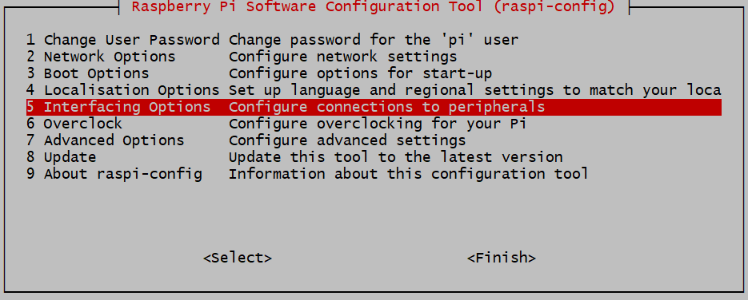
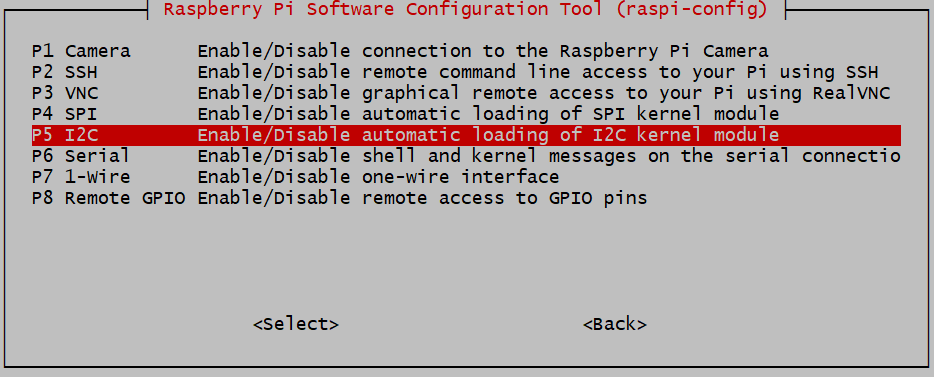
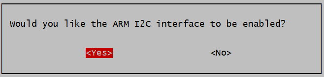
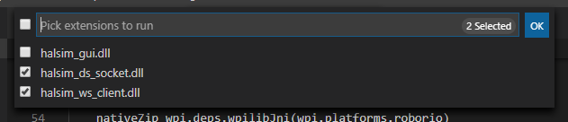
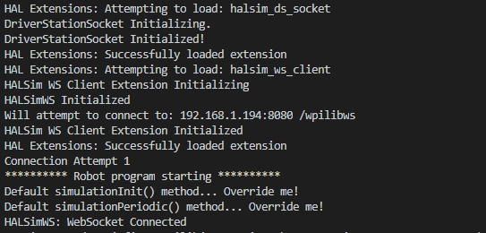

# wpilib-ws-robot-romi

Pololu Romi 32U4 Reference Robot for WPILib WebSocket Interface

## **Introduction**
This repository contains a reference implementation of a robot that can be controlled via the WPILib HALSim WebSocket extensions. The chassis and controller are based around the [Romi robot](https://www.pololu.com/category/202/romi-chassis-and-accessories) and associated [Control Board](https://www.pololu.com/product/3544) from Pololu.

## **Kit of Parts**
Please refer to our [Kit of Parts](docs/KitOfParts.md) for phyical hardware needs.

## **Software Dependencies**
It is assumed that the steps necessary for installation of [FRC 2020](https://docs.wpilib.org/en/stable/docs/getting-started/getting-started-frc-control-system/index.html) (specifically FRC VS Code 2020 and FRC Driver Station) have been executed prior as they are a dependency for this project.

## **Raspbery Pi Installation**
This section covers everything that needs to be installed on the Raspberry Pi.
### **Installing and configuring Raspberry Pi OS**
1. Format and install Raspberry Pi OS on your micro SD Card. The steps to do this can be found [here](https://www.raspberrypi.org/documentation/installation/installing-images/) (We recommend using Raspberry Pi Imager) 
1.  Configure your Raspberry Pi for Wifi and ssh per steps [here](https://desertbot.io/blog/headless-raspberry-pi-3-bplus-ssh-wifi-setup)
1. Insert SD card into the Pi and power on
1. SSH in using pi@raspberrypi (username pi, password raspberry)
1. Setup i2c:<pre><code>sudo raspi-config
</code></pre>
6. Enable i2c per screenshots below:



### **Installing node and romi node package**
1. Install nodejs on the Pi using instructions at [nvm github repo](https://github.com/nvm-sh/nvm)
1. Install romi node package:<pre><code>npm install -g wpilib-ws-robot-romi</code></pre>
Or clone this repository and use:<pre></code>npm install</code></pre>
1. Run the binary. This will launch a WebSocket server on port 8080, as well as attempt to connect to Romi 32U4 control board.<pre><code>wpilibws-romi
</code></pre>
Or if cloned, use:<pre><code>npm run start</code></pre>
1. (Optional) set wpilibws-romi to launch upon startup. *If you are using this repository locally on the pi, change 'ExecStart=wpilibws-romi' to 'ExecStart=node \<directory cloned\>/wpilib-ws-robot-romi/dist/index.js' instead.*
Create wpilibws-romi.service in `/etc/systemd/system/` with the following code:<pre><code>[Unit]
Description=WPILIB Drivethrough
After=network.target<br />
[Service]
ExecStart=wpilibws-romi
WorkingDirectory=/home
StandardOutput=inherit
StandardError=inherit
Restart=always
User=pi<br />
[Install]
WantedBy=multi-user.target
</code></pre>
Then run the following command:<pre><code>sudo systemctl enable wpilibws-romi.service
</code></pre>

NOTE: The application will only run correctly on a Raspberry Pi that is connected to the Romi 32U4 board. (This is a reference implementation after all)

## **Controlling The Robot via WPILib**
To connect your WPILib-based robot program to the Romi reference robot, you will need a few things:
- A Raspberry Pi 3/4 and a Romi 32U4 control board (follow the hardware assembly instructions [here](https://www.pololu.com/blog/663/building-a-raspberry-pi-robot-with-the-romi-chassis))
- Appropriate firmware on the Romi (See the [firmware README](firmware/wpilib-ws-romi/README.md) for instructions)
- An up-to-date version of WPILib (See Note on WPILib below for more information)

### **Note on WPILib**
As of this writing, a published version of WPILib containing the WebSocket extensions is not yet available. To test this out, you will need to build a local copy of WPILib and have it linked to your robot code.

Clone the [WPILib repository](https://github.com/wpilibsuite/allwpilib) to your robot code development computer. Once that is done, run `./gradlew publish` which will build all of WPILib (including the HALSim extensions) and publish them to a maven repository on your local computer (specifically in `~/releases/maven/development`).

In your robot project's `build.gradle` file, add the following lines below the `plugins` block:

```groovy
wpi.maven.useFrcMavenLocalDevelopment = true
wpi.wpilibVersion = "2020.424242.+"
```

The top of your `build.gradle` file should look something like this:
```groovy
plugins {
    id "java"
    id "edu.wpi.first.GradleRIO" version "2020.3.2"
}

wpi.maven.useFrcMavenLocalDevelopment = true
wpi.wpilibVersion = "2020.424242.+"
```

You will also need to create a file named `WPILibMath2020.json` in the `vendordeps` folder (at root level of VSCode project) with the following content:
```
{
  "fileName": "WPILibMath2020.json",
  "name": "WPILib-Math-2020",
  "version": "2020.0.0",
  "uuid": "42aa5bbe-f8f5-493f-914a-16cb5d7507f3",
  "mavenUrls": [],
  "jsonUrl": "",
  "javaDependencies": [
      {
          "groupId": "edu.wpi.first.wpimath",
          "artifactId": "wpimath-java",
          "version": "wpilib"
      }
  ],
  "jniDependencies": [
      {
          "groupId": "edu.wpi.first.wpimath",
          "artifactId": "wpimath-cpp",
          "version": "wpilib",
          "isJar": false,
          "skipInvalidPlatforms": true,
          "validPlatforms": [
              "linuxathena",
              "linuxraspbian",
              "linuxaarch64bionic",
              "windowsx86-64",
              "windowsx86",
              "linuxx86-64",
              "osxx86-64"
          ]
      }
  ],
  "cppDependencies": [
      {
          "groupId": "edu.wpi.first.wpimath",
          "artifactId": "wpimath-cpp",
          "version": "wpilib",
          "libName": "wpimath",
          "headerClassifier": "headers",
          "sourcesClassifier": "sources",
          "sharedLibrary": true,
          "skipInvalidPlatforms": true,
          "binaryPlatforms": [
              "linuxathena",
              "linuxraspbian",
              "linuxaarch64bionic",
              "windowsx86-64",
              "windowsx86",
              "linuxx86-64",
              "osxx86-64"
          ]
      }
  ]
}
```

With this, your robot project is set to be run against the local development build of WPILib.

### **Configuring Robot Project**
In order to actually be able to use the extensions, we'll need to add them as dependencies. To do this, add this to your `dependencies` block:

```groovy
simulation "edu.wpi.first.halsim:halsim_ds_socket:${wpi.wpilibVersion}:${wpi.platforms.desktop}@zip"
simulation "edu.wpi.first.halsim:halsim_ws_client:${wpi.wpilibVersion}:${wpi.platforms.desktop}@zip"
```

This provides access to the WebSocket (client) extension as well as the DS extension (which allows you to use the actual FRC Driver Station) with your simulated robot code.

### **Running Robot Project**
First, ensure that this application is running on the Raspberry Pi. If it's not, start it on the Pi with `wpilibws-romi` or `npm run start` if code cloned locally.

Next, set an environment variable `HALSIMWS_HOST` to be whatever the IP address of the Raspberry Pi is.

Finally, in your robot project, Hit `F5` or run `Simulate Robot Code on Desktop` from the VSCode Palette (`Ctrl+Shift+P`).


Once your code compiles, a new selection dialog will appear. This lists all the extensions you had listed under `dependencies` in your `build.gradle` file. Select the `halsim_ds_socket.[so/dylib/dll]` and `halsim_ws_client.[so/dylib/dll]` options (file extension depends on your OS).



Upon clicking `OK`, your robot project should start running on the desktop, and you should something similar to the image below in your console:



If you see the line `WebSocket Connected`, you have established a connection to your robot! From this point, your WPILib-based robot code will trigger corresponding behaviors on the Romi (e.g. if you output `HIGH` on `DigitalOutput` channel 3, the yellow LED on the Romi will turn on). For more information about the pin mappings and assignments, see the [firmware README](firmware/wpilib-ws-romi/README.md).

## **Theory of Operation**
This section provides more technical details on how this package works.

### **Communication Between Raspberry Pi and Romi 32U4 Board**
The Raspberry Pi and Romi 32U4 boards are connected via the 40-pin connector, and communicate over I2C. The Romi firmware uses the [Pololu Raspberry Pi interface library for Arduino](https://github.com/pololu/pololu-rpi-slave-arduino-library) to facilitate board-to-board communication.

Both boards essentially utilize a "shared memory buffer" to read/write to. The layout of this buffer can be found in the `sharedmem.json` file. Since both the firmware and JS code need to have the same buffer layout, the `generate-buffer.js` script reads in the `sharedmem.json` file and automatically generates a `shmem_buffer.h` file for the firmware and a `romi-shmem-buffer.ts` file for the Node application, thus keeping both sets of files in sync.

### **Application Structure**
The main entry point for the application is `src/index.ts`. The file is fairly small and serves as a binding layer for the `WPILibWSRomiRobot` class (which is defined in `src/romi-robot.ts`) and the `WPILibWSRobotEndpoint` class (which is defined in the [wpilib-ws-robot](https://github.com/bb-frc-workshops/wpilib-ws-robot) NPM package).

The `wpilib-ws-robot` package provides a wrapper around the guts of the WPILib WebSocket protocol, and allows developers to easily interface with other kinds of robots, simply by extending from the `WPILibWSRobotBase` class (also exposed by `wpilib-ws-robot`).

In the `src/romi-robot.ts` file, you can see how the defined class interacts with the Romi firmware over I2C.

The `src/i2c` folder contains both an I2C abstraction layer, and concrete implementations of a Raspberry Pi compatible I2C bus (`src/i2c/hw-i2c.ts`) and a mock I2C bus (`src/i2c/mock-i2c.ts`) that can be used for testing on non-Raspberry Pi platforms.

### **`wpilib-ws-robot` and `node-wpilib-ws` Packages**
This application depends on the `wpilib-ws-robot` package (as mentioned above), which in turn depends on `node-wpilib-ws`. The `node-wpilib-ws` package contains the core classes that implement the WPILib WebSocket protocol, and the code can be found at its [repository](https://github.com/bb-frc-workshops/node-wpilib-ws).

See the READMEs in each of the dependent packages to find out more about how to use them outside of this application.
