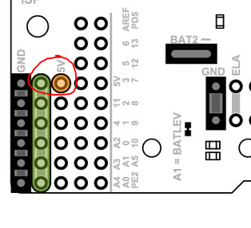

# WPILibWS Reference Robot (Romi 32U4)
This README provides information about how to prepare your Romi 32U4 board for use with the WPILib WebSocket extension.

## Overview
Out of the box, the Romi 32U4 acts as an Arduino compatible microcontroller, with several built in actuators and inputs (e.g. buttons, motors, encoders, etc). We will leverage these built in components in a way that also allows interoperability with WPILib code.

### Port mapping differences between RoboRIO and Romi 32U4
The RoboRIO provides separate banks for Digital IO, Analog In, Relays and PWM Out. On the Romi 32U4, many of the exposed ports can have multiple functions (e.g. a digital IO port can also be configured as an analog in port).

To fit in with the RoboRIO/WPILib model of separate banks, we configure the pins/devices available on the Romi 32U4 board into separate banks as well. While this reduces the flexibility of port configuration somewhat, it makes it easier to get started with running WPILib-based robot code with the Romi robot.

## Hardware Modifications
To allow connecting to additional inputs/actuators (e.g. distance sensors or servos), we select a set of 5 pins on the Romi 32U4 board, and add pin headers to them. These pins are:

- Pin 11
- Pin 4 / Analog 6
- Pin 20 / Analog 2
- Pin 21 / Analog 3
- Pin 22 / Analog 4

You can see them on the front left side of the Romi board. For easy interfacing, solder pin headers for those 5 pins, as well as the ground and power rails. This will allow you to plug in a servo style 3-pin connector (similar to what is done on the RoboRIO).

Additionally, the middle power rail is not connected to anything, so solder another set of jumpers between that and the 5V pin (next to pin 11). Bridging this jumper connection will bring 5V to the middle power rail.

Once this is done, your hardware is ready for use. Read ahead for instructions on how to install the firmware on the board.

## Pin Mappings
For simplicity, we provide a hardcoded mapping of WPILib channels/devices to a subset of the IO pins available on the Romi.

Some of the channels are mapped to on-board hardware (buttons, LEDs, motors, encoders etc). There are 5 external interface pins (see the hardware section above) that are hard coded for specific functionality.

### Digital I/O
- DIO 0 -> Button A (input only)
- DIO 1 -> Button B (input), Green LED (output)
- DIO 2 -> Button C (input), Red LED (output)
- DIO 3 -> Yellow LED (output only)
- DIO 4 -> Reserved for Left Encoder Channel A
- DIO 5 -> Reserved for Left Encoder Channel B
- DIO 6 -> Reserved for Right Encoder Channel A
- DIO 7 -> Reserved for Right Encoder Channel B
- DIO 8 -> Pin 11

Writes to DIO 0, 4, 5, 6 and 7 will result in no-ops.

### Analog Input
- AIN 0 -> Analog 6 / Pin 4
- AIN 1 -> Analog 2 / Pin 20

### PWM Output
- PWM 0 -> Left Motor
- PWM 1 -> Right Motor
- PWM 2 -> Pin 21 / A3
- PWM 3 -> Pin 22 / A4

## Firmware
**NOTE: This section is for use if you plan to make changes to the Romi firmware.**

The `wpilib-ws-romi.ino` file contains the firmware for the reference robot. You can use the Arduino IDE to upload it.

The firmware uses a modified version of the `Servo` library. The built in `Servo` library uses `timer1` on the 32U4, which interferes with some of the other peripherals on the board. Thus we have included a version of `Servo` that uses `timer3` instead, and is named `ServoT3`.

To use this in the Arduino IDE, copy the `ServoT3` folder from `firmware/libs` into your `~/Arduino/libraries` folder.

Additionally, you can use:
<pre>pip install platformio
pip run firmware
</pre>
This will generate the hex executable `firmware/.pio/build/a-start32u4/firmware.hex` that can then be uploaded to the Romi.
